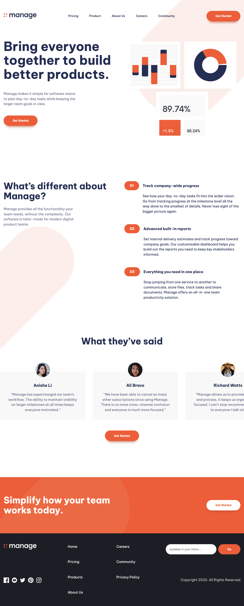

# Frontend Mentor - Manage landing page solution

This is a solution to the [Manage landing page challenge on Frontend Mentor](https://www.frontendmentor.io/challenges/manage-landing-page-SLXqC6P5). Frontend Mentor challenges help you improve your coding skills by building realistic projects. 

## Table of contents

- [Overview](#overview)
  - [The challenge](#the-challenge)
  - [Screenshot](#screenshot)
  - [Links](#links)
- [My process](#my-process)
  - [Built with](#built-with)
  - [What I learned](#what-i-learned)
  - [Continued development](#continued-development)
  - [Useful resources](#useful-resources)
- [Author](#author)
- [Acknowledgments](#acknowledgments)

**Note: Delete this note and update the table of contents based on what sections you keep.**

## Overview

### The challenge

Users should be able to:

- View the optimal layout for the site depending on their device's screen size
- See hover states for all interactive elements on the page
- See all testimonials in a horizontal slider
- Receive an error message when the newsletter sign up `form` is submitted if:
  - The `input` field is empty
  - The email address is not formatted correctly

### Screenshot



Screenshot of the final stage of the project

### Links

- Solution URL: [solution URL](https://github.com/Perlishnov/manage-landing-page-master)
- Live Site URL: [live site URL ](https://manage-landing-page-master-ecru.vercel.app/)

## My process

### Built with

- Semantic HTML5 markup
- CSS custom properties
- Flexbox
- CSS Grid
- Mobile-first workflow
- [A11Y Slider](https://a11yslider.js.org/) - JS library


### What I learned

I learned a lot while building this project. A few things I learned are:

*zoom* property in css

```css
.sales-points__blob::before {
  content: url("images/bg-tablet-pattern.svg");
  position: absolute;
  zoom: 40%;
  z-index: -1;
  left: 70%;
  bottom: 120%;
  width: 100px;
}
```
*counters* in css
```css
.numbered-items {
  counter-reset: count; /*resets the counter value to 1*/
  width: fit-content;
  margin-inline: auto;
}
.numbered-items li {
  counter-increment: count; /*Increments the value of the counter*/
}
```


### Continued development

I think a major area of improvement is naming conventions. There are a lot inconsistencies whenever I'm naming a class for example. I may use a convention here then use a different convention elsewere. Another thing to improve is there the use of utilities classes in my code.

